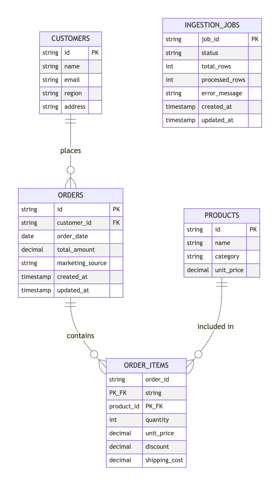

# Sales-Analytics API

High-throughput CSV → MySQL ingestion + analytics in Go.

## API Documentation
[SwaggerHub Documentation](https://app.swaggerhub.com/apis/freightify-65d/Lumel/1.0)



## Architecture
* **Gin** HTTP server (reverse-proxy friendly, high performance)
* **Google Wire** for compile-time dependency injection
* **Zap** for structured, JSON logs
* **Robfig/cron** for scheduled daily refresh
* **Streaming ingestion with optimized pipeline**  
  * CSV reader goroutine with 4MB buffer
  * Worker pool with `N = CPU cores` goroutines
  * Batch-oriented processing (500 rows/commit)
  * Back-pressure via buffered channels

## Technical Implementation
* **Dynamic Programming Approach**
  * Two-pass algorithm for efficient entity processing
  * Memoization tables for unique customers and products
  * Dependency-aware processing order (prerequisites first)
  * Optimized batch sizes based on benchmarks

* **Concurrent File Processing**
  * Multiple files handled via separate job contexts
  * Atomic counters for lock-free row tallying
  * Optimized connection pooling (20 max, 10 idle)
  * Worker goroutines with controlled concurrency

* **Duplicate Management**
  * Hash-based deduplication via map data structures
  * Unique constraints in database schema
  * REPLACE INTO for handling duplicate entities
  * Optimistic locking for concurrent operations

## Setup

```bash
git clone https://github.com/<you>/sales-analytics.git
cd sales-analytics

# copy & edit config
cp config/config.yaml.example config/config.yaml
$EDITOR config/config.yaml   # add your MySQL creds, CSV path

go mod tidy
go install github.com/google/wire/cmd/wire@latest
wire ./internal/di           # generate DI code
```

### Prerequisites
| Tool | Version | Purpose |
|------|---------|---------|
| Go | ≥ 1.22 | compile |
| MySQL | 8.x | data |
| (opt) Docker | latest | for swagger-ui |

## Running

```bash
go run ./cmd/server        # default port 8080
```

### Upload a CSV

```bash
curl -F file=@sample_data.csv http://localhost:8080/api/v1/ingestion/upload
```

## Config
`config/config.yaml.example`

```yaml
app:
  port: 8080
  mode: debug        # debug | release
db:
  user: YOUR_USER
  password: YOUR_PASS
  host: 127.0.0.1
  port: "3306"
  name: sales_db
csv:
  path: /absolute/path/to/sample_data.csv
cron:
  spec: "0 0 * * *"  # daily at midnight
```

## Project Structure
```
cmd/server         → main entry, Wire injector
config/            → Viper YAML
docs/
  swagger/         → OpenAPI 3.0 spec
  db/              → ER diagram
internal/
  di/              → providers + wire_gen.go
  handler/         → Gin controllers
  service/         → business logic (ingestion / analytics)
  repository/      → SQL access layer
  models/          → pure structs
  utils/           → response helpers
  errors/          → central API errors
pkg/orm/           → tiny helper (exec/query wrappers)
sample_data.csv    → demo file
```
